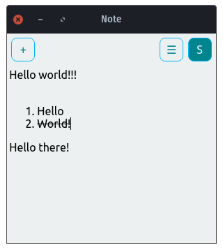

# StickyNote

A sticky notes app.

---

<p align="center">
	
	
</p>

---

## Getting Started

Clone:

```git
git clone https://github.com/KleoHasani/StickyNote.git
```

Install dependencies:

```npm
npm install
```

Start:

```npm
npm start
```

### Required

-   Electron v13.1.5

-   Electron Builder v22.11.7

-   Node v16.3.0

-   NPM v7.15.1

### Build With

-   Electron Builder v22.9.1

Build:

```npm
npm run build
```

Windows:

-   dist/_installer_.exe

Debian:

-   dist/_installer_.deb

-   dist/_installer_.AppImage

## Version

v1.0.5

## Authors

Kleo Hasani

## Notes

Support for:

-   [x] Windows 10

-   [x] Debian 10

-   [x] AppImage
